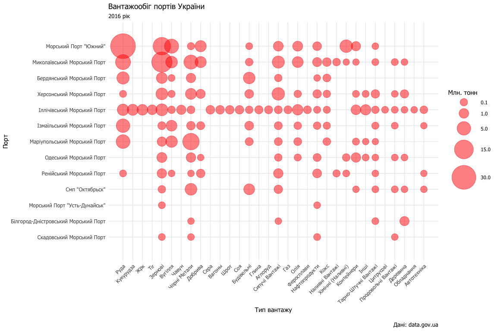

Аналіз вантажообігу портів України в 2016 році
================
Микола Павлов
21.04.2017

``` r
library(tidyverse)
library(lubridate)
library(stringr)
library(forcats)
library(viridis)
```

Завантаження даних
------------------

Дані були завантажени [з реєстру судозаходів на сайті data.gov.ua](http://data.gov.ua/passport/08e7925e-4e38-47d1-abe2-d9dd30cab29e).

``` r
ports <- read_csv("data/data.csv", 
                  col_types = 'c_?t?tccccnccnc_', 
                  na = c('', 'БН', 'бн')) %>%
  rename(port = `Назва порту`, 
         arrival = `Дата приходу судна`,
         arrival_time = `Час приходу судна (24-годинний формат)`,
         departure = `Дата відходу судна`,
         departure_time = `Час відходу судна (24-годинний формат)`,
         vessel_id = `ІМО № судна`,
         vessel_name = `Назва судна`,
         vessel_type = `Тип судна (згідно з документами)`,
         flag = `Прапор`,
         deadweight = `Дедвейт (тонни)`,
         purpose = `Мета заходу (завантаження/ розвантаження/ круіз)`,
         cargo = `Назва вантажу`,
         cargo_weight = `Загальна кількість вантажу тис. тонн`,
         company = `Компанія з агентування судна`) %>%
  filter(row_number(port) != 1) %>%
  mutate_at(vars(port, vessel_type, cargo, flag, purpose), str_to_title) %>%
  mutate(cargo_weight = cargo_weight * 1000) %>%
  mutate(port = factor(port),
         vessel_type = factor(vessel_type), 
         purpose = factor(purpose),
         cargo = factor(cargo))

ports
```

    ## # A tibble: 25,832 × 14
    ##                            port    arrival arrival_time  departure
    ##                          <fctr>      <chr>       <time>      <chr>
    ## 1  Маріупольський Морський Порт 30.03.2015     13:45:00 01.04.2015
    ## 2  Маріупольський Морський Порт 01.04.2015     09:30:00 04.04.2015
    ## 3  Маріупольський Морський Порт 01.08.2015     13:15:00 04.08.2015
    ## 4  Маріупольський Морський Порт 31.03.2015     21:00:00 05.04.2015
    ## 5  Маріупольський Морський Порт 29.06.2015     13:40:00 01.07.2015
    ## 6  Маріупольський Морський Порт 02.04.2015     11:20:00 03.04.2015
    ## 7  Маріупольський Морський Порт 26.10.2015     03:00:00 28.10.2015
    ## 8  Маріупольський Морський Порт 19.08.2015     14:35:00 21.08.2015
    ## 9  Маріупольський Морський Порт 20.08.2015     00:40:00 24.08.2015
    ## 10 Маріупольський Морський Порт 23.11.2015     10:50:00 27.11.2015
    ## # ... with 25,822 more rows, and 10 more variables: departure_time <time>,
    ## #   vessel_id <chr>, vessel_name <chr>, vessel_type <fctr>, flag <chr>,
    ## #   deadweight <dbl>, purpose <fctr>, cargo <fctr>, cargo_weight <dbl>,
    ## #   company <chr>

Очищення даних
--------------

Почнемо з перевірки унікальних категорій.

``` r
# Print factors
fct <- ports %>% 
  select_if(is.factor)

levels(fct$port)
```

    ##  [1] "Бердянський Морський Порт"           
    ##  [2] "Білгород-Дністровський Морський Порт"
    ##  [3] "Ізмаїльський Морський Порт"          
    ##  [4] "Іллічівський Морський Порт"          
    ##  [5] "Маріупольський Морський Порт"        
    ##  [6] "Миколаївський Морський Порт"         
    ##  [7] "Морський Порт \"Усть-Дунайськ\""     
    ##  [8] "Морський Порт \"Южний\""             
    ##  [9] "Одеський Морський Порт"              
    ## [10] "Ренійський Морський Порт"            
    ## [11] "Скадовський Морський Порт"           
    ## [12] "Смп \"Октябрьск\""                   
    ## [13] "Херсонський Морський Порт"

``` r
levels(fct$cargo)
```

    ##  [1] "Tir"                                 
    ##  [2] "А/Техн"                              
    ##  [3] "Автомобілі (Тис. Тонн)"              
    ##  [4] "Автомобілі (Шт)"                     
    ##  [5] "Автотехніка Й Сільгосптехніка"       
    ##  [6] "Аглоруд"                             
    ##  [7] "Бензин"                              
    ##  [8] "Будівельни Матеріали"                
    ##  [9] "Будівельні"                          
    ## [10] "Вагоны"                              
    ## [11] "Вино"                                
    ## [12] "Вугілля"                             
    ## [13] "Газ"                                 
    ## [14] "Газойль"                             
    ## [15] "Генвантаж"                           
    ## [16] "Глина"                               
    ## [17] "Дизельне Паливо"                     
    ## [18] "Жмых"                                
    ## [19] "Жрк"                                 
    ## [20] "Зерно"                               
    ## [21] "Известн"                             
    ## [22] "Ильмен"                              
    ## [23] "Інші Наливні Вантажі"                
    ## [24] "Інші Сипучі Вантажі"                 
    ## [25] "Інші Тарно-Штучні Вантажі"           
    ## [26] "Кислота"                             
    ## [27] "Кокс"                                
    ## [28] "Контейн"                             
    ## [29] "Контейнери"                          
    ## [30] "Контейнери (Теu)"                    
    ## [31] "Контейнери (Тис. Тонн)"              
    ## [32] "Кукурудза"                           
    ## [33] "Кукуруз"                             
    ## [34] "Курага"                              
    ## [35] "Лісні Вантажі"                       
    ## [36] "Мазут"                               
    ## [37] "Масло"                               
    ## [38] "Масло Р"                             
    ## [39] "Масло Рослинне"                      
    ## [40] "Мет/Лом"                             
    ## [41] "Метал"                               
    ## [42] "Металл"                              
    ## [43] "Металобрухт"                         
    ## [44] "Нафта"                               
    ## [45] "Нафтопродукти"                       
    ## [46] "Нефтепр"                             
    ## [47] "Обладнання"                          
    ## [48] "Оборуд"                              
    ## [49] "Окатиші Залізорудні"                 
    ## [50] "Окатыши"                             
    ## [51] "Олія"                                
    ## [52] "Отруби"                              
    ## [53] "Папір"                               
    ## [54] "Пек Кам'яновугільний"                
    ## [55] "Продовольчі Вантажі - Всього"        
    ## [56] "Продукт"                             
    ## [57] "Пром.товари В Ящиках І Кіпах"        
    ## [58] "Пшеница"                             
    ## [59] "Пшениця"                             
    ## [60] "Рапс"                                
    ## [61] "Руда"                                
    ## [62] "Руда Всяка"                          
    ## [63] "Руда М"                              
    ## [64] "Руда Н"                              
    ## [65] "Рыба"                                
    ## [66] "Сера"                                
    ## [67] "Сера Гр"                             
    ## [68] "Сера Ко"                             
    ## [69] "Силос"                               
    ## [70] "Сода"                                
    ## [71] "Солома"                              
    ## [72] "Сорго"                               
    ## [73] "Соя"                                 
    ## [74] "Суг"                                 
    ## [75] "Трубы"                               
    ## [76] "Уголь"                               
    ## [77] "Ф/Марга"                             
    ## [78] "Ф/Никел"                             
    ## [79] "Ф/Силиц"                             
    ## [80] "Ф/Сплав"                             
    ## [81] "Феррони"                             
    ## [82] "Фс/Марг"                             
    ## [83] "Хім. Та Мін. Добрива (Тарно-Штучні)" 
    ## [84] "Хімічні (Наливні)"                   
    ## [85] "Хімічні, Мінеральні Добрива (Сипучі)"
    ## [86] "Хлібні - Всього"                     
    ## [87] "Цемент (В Тарі)"                     
    ## [88] "Цитрус"                              
    ## [89] "Цитрусові"                           
    ## [90] "Цукор"                               
    ## [91] "Чавун"                               
    ## [92] "Чорні Метали - Всього"               
    ## [93] "Чугун"                               
    ## [94] "Шрот"                                
    ## [95] "Ячмень"                              
    ## [96] "Ячмінь"

``` r
levels(fct$vessel_type)
```

    ##  [1] "Автомобилевоз"       "Балкер"              "Баржа"              
    ##  [4] "Баржа Несамохідна"   "Баржа Самохідна"     "Буксир"             
    ##  [7] "Буксир Толкач"       "Вантажопасажирське"  "Газовоз"            
    ## [10] "Контейнеровоз"       "Лісовоз"             "Ліхтеровоз"         
    ## [13] "Нафтобалкер"         "Нафторудовоз"        "Паром"              
    ## [16] "Пасажирське"         "Пасажирське Річкове" "Пл.кран"            
    ## [19] "Плавкран"            "Рефрежераторне"      "Рефрежиратор"       
    ## [22] "Ро-Ло"               "Ро-Ро"               "Скотовоз"           
    ## [25] "Службово-Допоміжне"  "Суховантаж"          "Сухогруз"           
    ## [28] "Танкер"              "Танкер Річний"       "Танкер-Газовоз"

``` r
levels(fct$purpose)
```

    ## [1] "Выгрузка"      "Завантаження"  "Інше"          "Круїз"        
    ## [5] "Навантаження"  "Погрузка"      "Розвантаження"

Деякі категорії дублюються на різних мовах або мають близьке значення. Спростимо список і зменшимо їх кількість.

``` r
ports <- ports %>%
  mutate(purpose = str_replace(purpose, "Выгрузка", "Розвантаження")) %>% 
  mutate(purpose = str_replace(purpose, "Погрузка", "Завантаження")) %>%
  mutate(purpose = str_replace(purpose, "Навантаження", "Завантаження")) %>%
  mutate(cargo = str_replace(cargo, "Ячмень", "Ячмінь")) %>%
  mutate(cargo = str_replace(cargo, "(Нафт.*|Нефт.*)", "Нафтопродукти")) %>%
  mutate(cargo = str_replace(cargo, "Масло.*", "Олія")) %>%
  mutate(cargo = str_replace(cargo, "Мет/Лом", "Металобрухт")) %>%
  mutate(cargo = str_replace(cargo, "Металл", "Метал")) %>%
  mutate(cargo = str_replace(cargo, "Оборуд", "Обладнання")) %>%
  mutate(cargo = str_replace(cargo, "Чугун", "Чавун")) %>%
  mutate(cargo = str_replace(cargo, "Окат.*", "Окатиші")) %>%
  mutate(cargo = str_replace(cargo, "Руда.*", "Руда")) %>%
  mutate(cargo = str_replace(cargo, "Сера.*", "Сера")) %>%
  mutate(cargo = str_replace(cargo, "Сера.*", "Сера")) %>%
  mutate(cargo = str_replace(cargo, "Лісні Вантажі", "Деревина")) %>%
  mutate(cargo = str_replace(cargo, "Кукуруз", "Кукурудза")) %>%
  mutate(cargo = str_replace(cargo, "Кукуруз", "Кукурудза")) %>%
  mutate(cargo = str_replace(cargo, "Будівель.*", "Будівельні")) %>%
  mutate(cargo = str_replace(cargo, "А/Техн", "Автотехніка")) %>%
  mutate(cargo = str_replace(cargo, " - Всього", "")) %>%
  mutate(cargo = str_replace(cargo, ".*Добрива.*", "Добрива")) %>%
  mutate(cargo = str_replace(cargo, "Цитрус.*", "Цитрусові")) %>%
  mutate(cargo = str_replace(cargo, "(Ф|Фс)/.*", "Феросплави")) %>%
  mutate(cargo = str_replace(cargo, "Пшеница", "Пшениця")) %>%
  mutate(cargo = str_replace(cargo, "(Хлібні.*|Ячмінь|Пшениця|Зерно)", "Зернові")) %>%
  mutate(cargo = str_replace(cargo, "Конт.*", "Контейнери")) %>%
  mutate(cargo = str_replace(cargo, "Авто.*", "Автотехніка")) %>%
  mutate(cargo = str_replace(cargo, "Інші ", "")) %>%
  mutate(cargo = fct_drop(cargo)) %>%
  mutate(purpose = fct_drop(purpose))
```

Перевіримо на статистики змінних.

``` r
summary(ports)
```

    ##                            port        arrival          arrival_time     
    ##  Ізмаїльський Морський Порт  :8256   Length:25832       Length:25832     
    ##  Миколаївський Морський Порт :2966   Class :character   Class1:hms       
    ##  Херсонський Морський Порт   :2925   Mode  :character   Class2:difftime  
    ##  Іллічівський Морський Порт  :2332                      Mode  :numeric   
    ##  Маріупольський Морський Порт:1941                                       
    ##  Ренійський Морський Порт    :1763                                       
    ##  (Other)                     :5649                                       
    ##   departure         departure_time     vessel_id        
    ##  Length:25832       Length:25832      Length:25832      
    ##  Class :character   Class1:hms        Class :character  
    ##  Mode  :character   Class2:difftime   Mode  :character  
    ##                     Mode  :numeric                      
    ##                                                         
    ##                                                         
    ##                                                         
    ##  vessel_name                   vessel_type        flag          
    ##  Length:25832       Балкер           :11692   Length:25832      
    ##  Class :character   Баржа Несамохідна: 7136   Class :character  
    ##  Mode  :character   Буксир Толкач    : 1032   Mode  :character  
    ##                     Танкер           :  973                     
    ##                     Ро-Ро            :  893                     
    ##                     (Other)          : 4101                     
    ##                     NA's             :    5                     
    ##    deadweight               purpose                 cargo     
    ##  Min.   :      0   Завантаження :19446   Руда          :5450  
    ##  1st Qu.:   1814   Інше         : 3040   Зернові       :2776  
    ##  Median :   3498   Круїз        :   75   Чорні Метали  :2769  
    ##  Mean   :  11510   Розвантаження: 3271   Сипучі Вантажі:1834  
    ##  3rd Qu.:  10396                         Вугілля       :1710  
    ##  Max.   :1810009                         (Other)       :8180  
    ##  NA's   :18                              NA's          :3113  
    ##   cargo_weight         company         
    ##  Min.   :        0   Length:25832      
    ##  1st Qu.:     1516   Class :character  
    ##  Median :     3006   Mode  :character  
    ##  Mean   :   879291                     
    ##  3rd Qu.:     9906                     
    ##  Max.   :122635000                     
    ##  NA's   :3101

Видно, що в змінних `deadweight` та `cargo_weight` є аномально великі значення. Зі [списку найбільш вантажних кораблів](https://en.wikipedia.org/wiki/List_of_largest_ships_by_gross_tonnage) випливає, що максимальний `deadweight` діючих суден не перевищує 234 006 тонн. Подивимося які кораблі є викидами.

``` r
max_deadweight <- 234006
ports %>% 
  filter(deadweight > max_deadweight) %>%
  distinct(vessel_name, deadweight)
```

    ## # A tibble: 2 × 2
    ##   vessel_name deadweight
    ##         <chr>      <dbl>
    ## 1     DJANKOY     288828
    ## 2  KSL SYDNEY    1810009

Виходячи [зі знайденої інформації](http://www.marinetraffic.com/en/ais/details/ships/shipid:688863/mmsi:477694800/imo:9683269/vessel:KSL_SYDNEY) судно `KSL SYDNEY` має `deadweight` 181 009 тонн. Тоннаж судна `DJANKOY` не був знайдений, тому було прийнято рішення прибрати цей корабель з набору даних.

``` r
ksl_sydney <- 181009
ports <- ports %>%
  mutate(deadweight = ifelse(vessel_name == 'KSL SYDNEY', ksl_sydney, deadweight)) %>%
  filter(vessel_name != "DJANKOY") %>%
  filter(deadweight >= cargo_weight) 
```

Дослідження даних
-----------------

Почнемо з гістограми тоннажу вантажів по портах України. Бачимо, що більшість вантажних операцій припадає на невеликі вантажні судна.

``` r
library(ggplot2)
ggplot(ports) +
  geom_histogram(aes(x = cargo_weight), bins = 30) +
  facet_wrap(~port)
```


Подивимося на бокс плот, щоб оцінити розкид тоннажу.

``` r
ggplot(ports) +
  geom_boxplot(aes(x = port, y = cargo_weight)) + 
  coord_flip()
```


Для зручності відсортуємо порти в порядку зменшення вантажообігу. Бачимо, що порти Південний, Миколаївський і Маріупольський найбільші по тоннажу.

``` r
ggplot(ports) +
  geom_boxplot(aes(x = fct_reorder(port, cargo_weight, sum), y = cargo_weight)) + 
  coord_flip()
```


Попередній графік проте не дає уявлення про кількість операцій. Тут же видно, що порти в Ізмаїлі, Миколаєві та Херсоні перевершують інші за кількістю операцій за рахунок обслуговування кораблів з більш низьким тоннажем.

``` r
ggplot(ports) +
  geom_jitter(aes(x = fct_reorder(port, cargo_weight, length), y = cargo_weight), 
              size = rel(0.2),
              alpha = 0.5) + 
  coord_flip()
```


Цікаво подивитися на які види вантажів припадає найбільше вантажообігу. Схоже це Руда, Зернові і Чорні метали.

``` r
ports %>%
  filter(!is.na(cargo)) %>%
  ggplot() +
  geom_jitter(aes(x = fct_reorder(cargo, cargo_weight, sum), y = cargo_weight), 
              size = rel(0.2),
              alpha = 0.5) + 
  coord_flip()
```


Тепер подивимося на вантажообіг портів по типу вантажів. Оскільки категорій вантажів кілька десятків, залишимо тільки 30 найбільш часто зустрічаються, інші об'єднаємо в одну категорію.

``` r
other <- "Інші"
ports_by_cargo <- ports %>% 
  filter(!is.na(cargo)) %>%
  mutate(cargo = fct_lump(cargo, n = 30, other_level = other)) %>%
  group_by(port, cargo) %>%
  summarise(net_weight = sum(cargo_weight)) %>%
  mutate(net_weight = net_weight / 1e6) %>%
  arrange(desc(net_weight))

ggplot(ports_by_cargo) +
  geom_point(aes(x = fct_reorder(cargo, net_weight, .desc = T),
                 y = fct_reorder(port, net_weight),
                 size = net_weight),
             alpha = 0.5, 
             color = "red") + 
  scale_size("Млн. тонн", range = c(5, 20), breaks = c(0, .1, 1, 5, 15, 30))
```


Трохи розширимо межі графіка, додамо підписи, повернемо мітки по осі X і спростимо тему.

``` r
ggplot(ports_by_cargo) +
  geom_point(aes(x = fct_reorder(cargo, net_weight, .desc = T),
                 y = fct_reorder(port, net_weight),
                 size = net_weight),
             alpha = 0.5, 
             color = "red") + 
  scale_size("Млн. тонн", range = c(5, 20), breaks = c(0, .1, 1, 5, 15, 30)) +
  scale_x_discrete(expand = c(0, 1.5)) +
  scale_y_discrete(expand = c(0, 1.5)) +
  labs(x = "Тип вантажу", 
       y = "Порт", 
       title = 'Вантажообіг портів України',
       subtitle = '2016 рік',
       caption = '\nДані: data.gov.ua') +
  theme_minimal() +
  theme(text = element_text(family = "Tahoma")) +
  theme(axis.text = element_text(size = 9)) +
  theme(axis.text.x = element_text(angle = 45, hjust = 1, vjust = 1))
```



Змінимо розміри шрифтів, перенесемо легенду вгору, спростимо сітку і додамо відступи. Це і буде наша фінальна візуалізація.

Цікаво відзначити, що порт Південний є найбільшим перевізником Руди, Миколаївський порт - Зернових, а порт в Маріуполі - чорних металів. Іллічівський морський порт перевозить практично всі категорії товарів і не має чіткої спеціалізації.

``` r
p <- ggplot(ports_by_cargo) +
  geom_point(aes(x = fct_reorder(cargo, net_weight, .desc = T),
                 y = fct_reorder(port, net_weight),
                 size = net_weight),
             alpha = 0.5, 
             color = "red") + 
  scale_size("Млн. тонн", range = c(5, 20), breaks = c(0, .1, 1, 5, 15, 30)) +
  scale_x_discrete(expand = c(0, 1.5)) +
  scale_y_discrete(expand = c(0, 1.5)) +
  labs(x = "Тип вантажу", 
       y = "Порт", 
       title = 'Вантажообіг портів України',
       subtitle = '2016 рік',
       caption = '\nДані: data.gov.ua') + 
  theme_minimal() +
  theme(text = element_text(family = "Tahoma")) +
  theme(axis.text = element_text(size = 9)) +
  theme(axis.text.x = element_text(angle = 45, hjust = 1, vjust = 1)) +
  theme(plot.title = element_text(face = 'bold', size = 16)) + 
  theme(plot.subtitle = element_text(size = 12)) +
  theme(panel.grid = element_line(linetype = 'dotted', size = 0.5)) +
  theme(plot.margin = unit(rep(1, 4), 'cm')) +
  theme(legend.position = 'top') +
  theme(legend.title = element_text(size = 8)) +
  theme(legend.text = element_text(size = 8)) +
  theme(legend.key.height = unit(2, "pt")) +
  theme(legend.key.width = unit(25, "pt"))

print(p)
```


