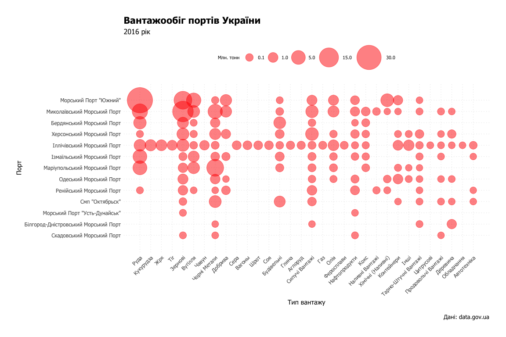

Вантажи портів України
================
Микола Павлов
21.04.2017

У 2016 році порт Південний став найбільшим перевізником Руди, Миколаївський порт - Зернових, а порт в Маріуполі - чорних металів. Іллічівський морський порт перевозить практично всі категорії товарів і не має чіткої спеціалізації.
